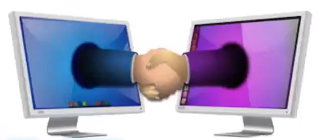
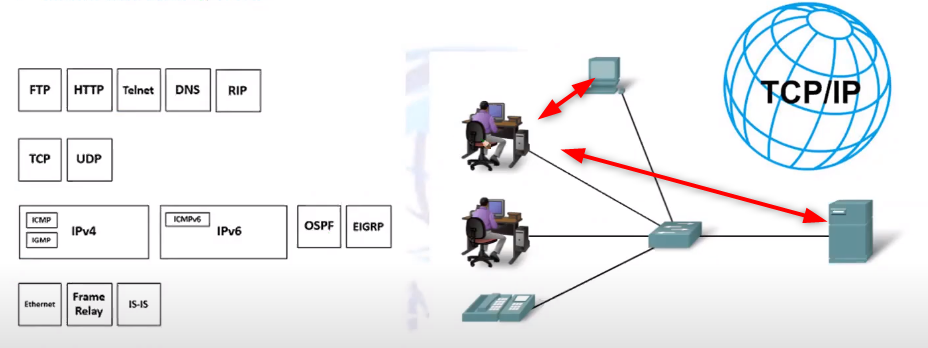

# [TCP/IP ADDRESSING](https://gns3.teachable.com/p/ip-addressing-subnetting-in-depth)
## What is Network Protocol? 

 
<ul>
    <li>
        Defines set of rules(or standards) to follow for communication between network devices.
        For example people communication with each other with language(standard in this case English).
          
        
          
        ALl computers need to follow standards to communication with each other. 
        
    </li>
    <li>
        In order two machine to talk to each other, they must be speaking the same language.
    </li>
</ul>

### Network set of Protocols Vendors Specific

| Name      | Provider              |
| :-------- | :-------------------- |
| *OSI      | ISO                   |
| *TCP/IP   | Department of Defense |
| NetBIOS   | Microsoft             |
| APPleTalk | Apple                 |
| IPX/SPX   | Novell                |
| ...       | ...                   |

# What is TCP/IP (Set of protocols)

<ul>
    <li>TCP is Transmission Control Protocol</li>
    <li>
       TCP/IP is a standard protocol used between computers and network devices for communicating.
    </li>
    <li>
        Internet work based on TCP/IP
    </li>
</ul>

[For read more](https://www.fortinet.com/resources/cyberglossary/tcp-ip)

