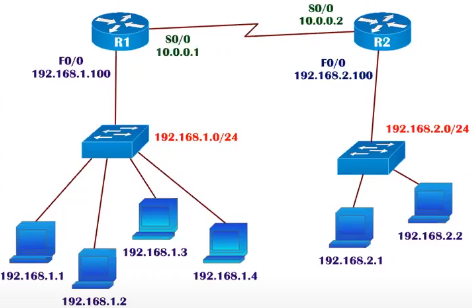

# TCP/IP Addressing

<ul>
    <li>
        IP Address is logical Address given to each and every device in the network
    </li>
    <li>
        IP Address used to identify specific device in the network
    </li>
</ul>

## Two version of Addressing

| Type                | Size     | Number of possible Addresses (2 power bits) |
| ------------------- | -------- | ------------------------------------------- |
| IP Version 4 (IPv4) | 32 bits  | 4294967296                                  |
| IP Version 6 (IPv6) | 128 bits | 340282366920938463463374607431768211456     |