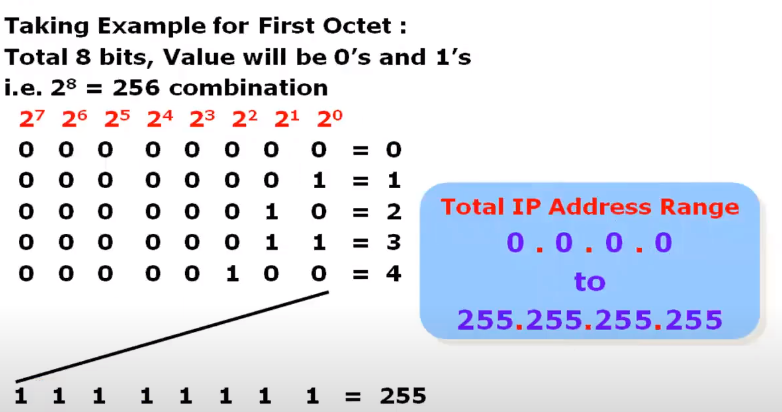

# TCP/IP Addressing

<ul>
    <li>
        IP Address is logical Address given to each and every device in the network
    </li>
    <li>
        IP Address used to identify specific device in the network
    </li>
</ul>

## Two version of Addressing

| Type                | Size     | Number of possible Addresses (2 power bits) |
| ------------------- | -------- | ------------------------------------------- |
| IP Version 4 (IPv4) | 32 bits  | 4294967296                                  |
| IP Version 6 (IPv6) | 128 bits | 340282366920938463463374607431768211456     |

# IPv4 Addresses 32 bits
| 11000000 | 10100000 | 00000111 | 00000001 |
| -------- | -------- | -------- | -------- |
| 8 bits   | 8 bits   | 8 bits   | 8 bits   |
| 192      | 168      | 7        | 1        |

11000000.10100000.00000111.00000001 === 192.160.7.1

128 + 64 = 192

# Range Of IPv4 Addresses

 
 

# IPv4 Address Classification

|                                          | First Octet | High order bits | Start IP  | End IP          |
| ---------------------------------------- | ----------- | --------------- | --------- | --------------- |
| Class A Range                            | 0 - 127     | 0               | 0.0.0.0   | 127.255.255.255 |
| Class B Range                            | 128 - 191   | 10              | 127.0.0.0 | 191.255.255.255 |
| Class C Range                            | 192 - 223   | 110             | 192.0.0.0 | 223.255.255.255 |
| Class D Range  reserved for Multicasting | 224 - 239   | 1110            | 224.0.0.0 | 239.255.255.255 |
| Class E Range  reserved for R&D          | 240 - 255   | 1111            | 240.0.0.0 | 255.255.255.255 |

## Type of communication

In an IPv4 network, the hosts can communicate one if three different ways:

<ul>
    <li>
        Unicast: The process of sending a packet from one host to an individual host.
         
        
    </li>
    <li>
        Broadcast: Sending a packet from one host to all hosts in the network.
         
        
    </li>
    <li>
        Multicast:
        <ul>
            <li>
                Sending a packet from one host to a selected group of hosts, possibly in different networks
            </li>
            <li>
                CLASS D 224-239 Reserved for Multicasting
            </li>
        </ul>
    </li>
</ul>