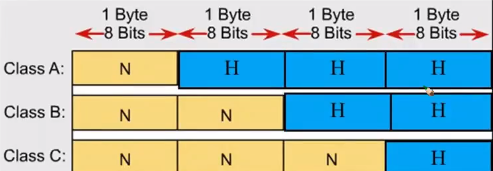
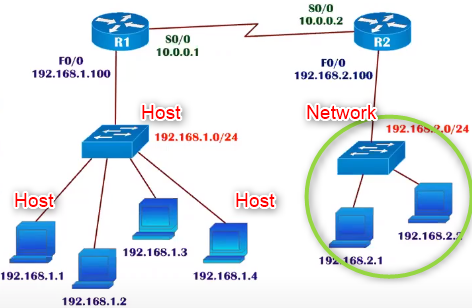
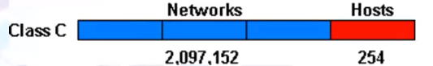
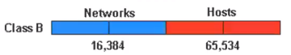
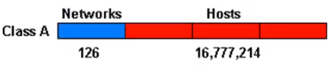

# Network and Host Portions

IP Address is divided into Network and Host Portions

 

<ul>
    <li>
        Host: a specific device in the network (in building it is like apt number)
    </li>
    <li>
        Network: set of devices (in building it is like floor number)
    </li>
</ul>

 

| Class C in range |
| ---------------- |
| 192.168.10.11    |
| 192.168.10.20    |

| Class C not in range |
| -------------------- |
| 192.168.10.11        |
| 192.168.15.20        |

| Class B in range |
| ---------------- |
| 172.16.10.11     |
| 172.16.12.148    |

| Class B not in range |
| -------------------- |
| 172.16.10.11         |
| 172.22.15.20         |

| Class A in range |
| ---------------- |
| 10.25.15.12      |
| 10.32.15.199     |

| Class A not in range |
| -------------------- |
| 10.25.15.12          |
| 12.45.90.15          |

## Rules to Assign IP Ranges

### Class C-Range N.N.N.H  192.168.1.X
<ul>
    <li>
        First three portions has to be same in order to be in same network
    </li>
    <li>
        X = any number from 0-255
    </li>
    <li>
        Number of total host Address in each network including networkId and broadcastId is 2 power 8 = 256
    </li>
</ul>

|    C-Class    |
| :-----------: |
|  192.168.1.0  |
|  192.168.1.1  |
|  192.168.1.2  |
|  -----------  |
|  -----------  |
|  -----------  |
| 192.168.1.253 |
| 192.168.1.254 |
| 192.168.1.255 |

 
 
 

### Class B-Range N.N.H.H  172.16.X.X
<ul>
    <li>
        First two portions has to be same in order to be in same network
    </li>
    <li>
        X = any number from 0-255
    </li>
    <li>
        Number of total host Address in each network including networkId and broadcastId is 2 power 16 = 65536
    </li>
</ul>

|    B-Class     |
| :------------: |
|   172.16.0.0   |
|   172.16.0.1   |
|   172.16.0.2   |
|  -----------   |
|  -----------   |
|  -----------   |
|  172.16.0.255  |
|  -----------   |
|  -----------   |
|  -----------   |
|   172.16.1.0   |
|   172.16.1.2   |
|  -----------   |
|  -----------   |
|  -----------   |
|  172.16.1.255  |
|  -----------   |
|  -----------   |
|  -----------   |
| 172.16.255.254 |
| 172.16.255.255 |

 
 
 

### Class A-Range N.H.H.H  10.X.X.X
<ul>
    <li>
        First  portion has to be same in order to be in same network
    </li>
    <li>
        X = any number from 0-255
    </li>
    <li>
        Number of total host Address in each network including networkId and broadcastId is 2 power 24 = 1677216
    </li>
</ul>

|    A-Class     |
| :------------: |
|    10.0.0.0    |
|    10.0.0.1    |
|    10.0.0.2    |
|  -----------   |
|  -----------   |
|  -----------   |
|   10.0.0.255   |
|  -----------   |
|  -----------   |
|  -----------   |
|    10.0.1.0    |
|    10.0.1.2    |
|  -----------   |
|  -----------   |
|  -----------   |
|  10.0.255.255  |
|  -----------   |
|  -----------   |
|    10.1.0.0    |
|  -----------   |
| 10.255.255.254 |
| 10.255.255.255 |

 
 
 

## Number of Hosts Addresses - Class A, B, C

<ul>
    <li>
        First and last address in each range are reserved for Network ID and Broadcast ID.
    </li>
    <li>
        Cannot assign this address to any device in the network    
    </li>
</ul>

|         |         |                 |          | Valid hosts numbers |
| ------- | ------- | --------------- | -------- | ------------------- |
| Class C | N.N.N.H | Hosts bits = 8  | 256      | 254                 |
| Class B | N.N.H.H | Hosts bits = 16 | 65536    | 65534               |
| Class A | N.H.H.H | Hosts bits = 24 | 16777216 | 16777214            |

### Network ID:
<ul>
    <li>
        First IP of the range
    </li>
    <li>
        Reserved for identifying complete network
    </li>
    <li>
        Cannot assign this address to any device in the network
    </li>
    <li>
        Only valid IP addresses are assigned to hosts/clients
    </li>
</ul>