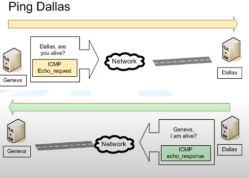
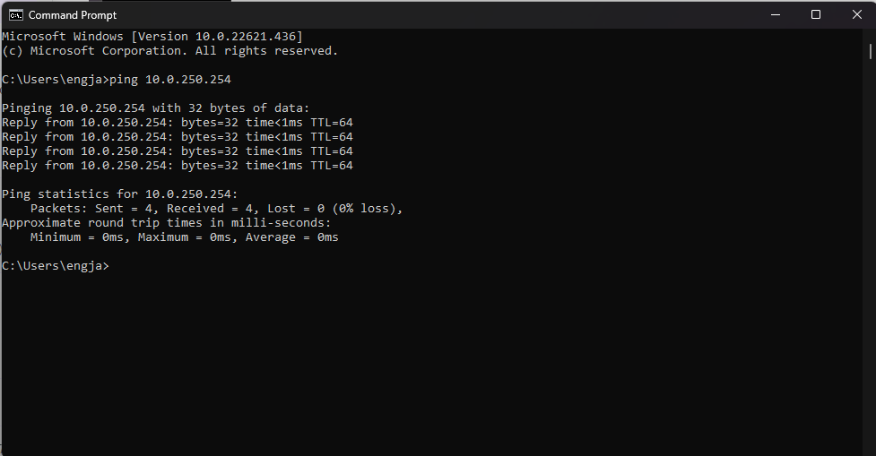
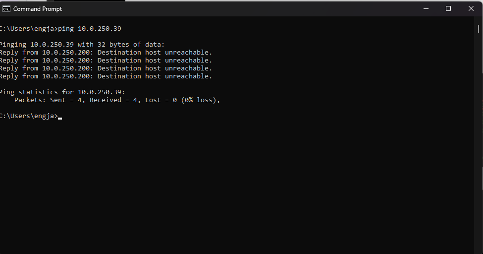
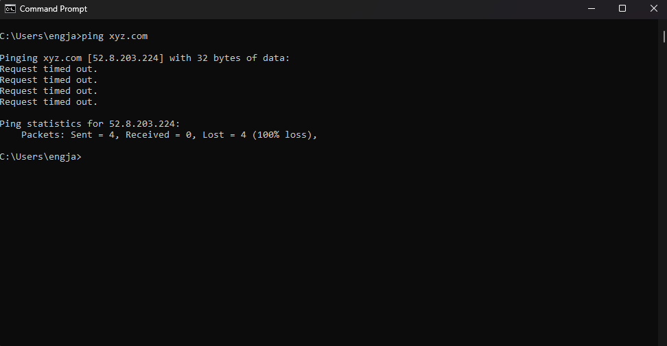
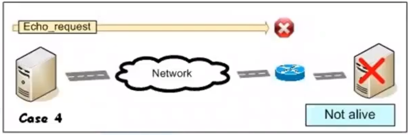
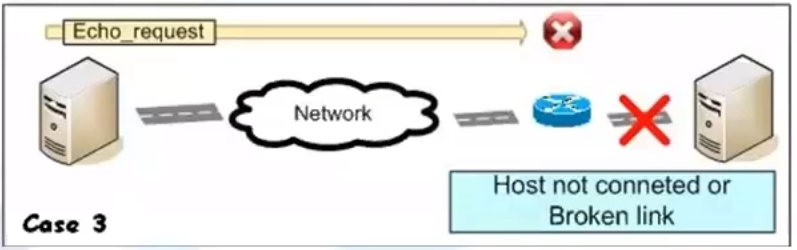
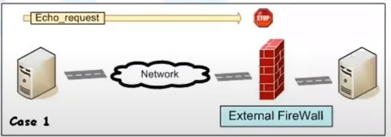
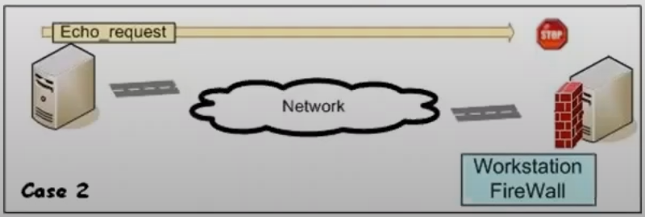

# Ping Command

 

<ul>
    <li>
        Simple way to test communication between 2 devices.
    </li>
    <li>
        Ping send very small packet to an ip host who will answer by sending packet back.
        <ul>
            <li>
                Called Echo_request and the packet send back Echo_response
            </li>
        </ul>
    </li>
</ul>

 

## Ping - ICMP Error reporting message

<ul>
    <li>
        Sometimes we don`t get echo ping reply from host machine
    </li>
    <li>
        Instead of that, we get some reply such as
        <ul>
            <li>
                Destination unreachable
                 
                
            </li>
            <li>
                Time exceeded ( request timed out )
                 
                
            </li>
        </ul>
    </li>
    <li>
        This is known as ICMP error reporting message
    </li>
</ul>

 
 
 

### Ping - Request timed out

 

<ul>
    <li>
        Did not answer to the Ping command.
    </li>
    <li>
        Negative answer does not always mean that the recipients is not alive.
        <ul>
            <li>
                Means that the host just does not answer to ICMP request. 
            </li>
        </ul>
    </li>
</ul>

#### Possible Reasons

<ul>
    <li>
        The host is down or has its network card deactivated.
         
        
         
         
    </li>
    <li>
        Pinged machine is not connected to the IP network.
         
        
         
         
    </li>
    <li>
        An external firewall blocks the ICMP requests.
         
        
         
         
    </li>
    <li>
        The workstation has a personal firewall that blocks the ICMP message.
         
        
         
         
    </li>
</ul>